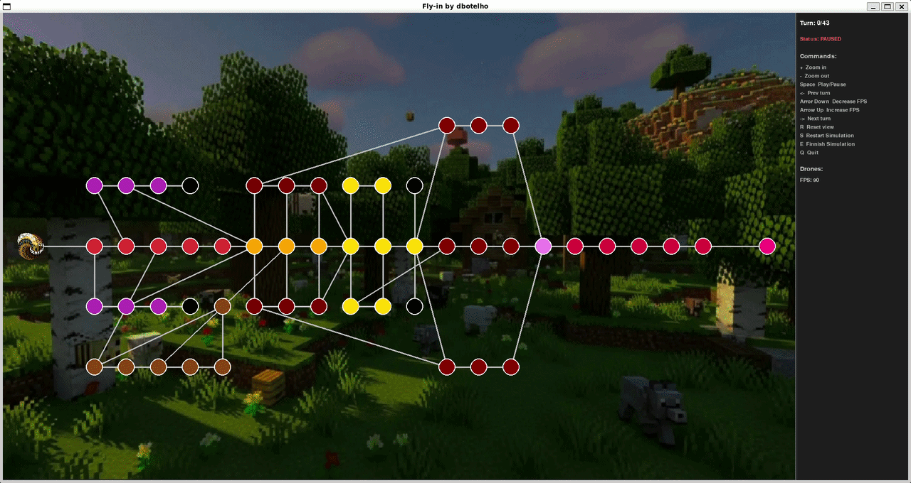

*This project has been created as part of the 42 curriculum by <a href ="https://github.com/sylvzzz">dbotelho</a>*

# Fly-in


# Description
This project consists in a drone routing simulator in Python with custom pathfinding for dynamic graphs. Handles simultaneous drone movement, zone occupancy rules, and conflict resolution while optimizing for minimal simulation turns while providing a visualizer for the simulation.

The goals of this project focus on:
- Graph algorithms
- OOP progamming
- Performance under real-world constraints like bottlenecks and deadlock prevention.
- Parsing and Data Validation
- Graphical design and programming
- Self teaching

# Instructions

To run this project please follow the tutorial below:

#### Install the dependencies for this project

```bash
make install
# please note that this will install only inside the virtual enviroment, not to the original pip of your machine
```


#### After installing and creating the virtual enviroment

```bash
source virtual_env/bin/activate # enter the virtual enviroment
```

#### Running 

```bash
python3 Fly-in.py maps/difficulty_of_your_coice/map_of_your_choice
```

#### Or via the Makefile:

```bash
make run       # run with default config
make debug     # run with pdb debugger
make clean     # remove __pycache__, .mypy_cache, etc.
```


# Resources

- [Dijkstra Algorithm](https://www.youtube.com/watch?v=EFg3u_E6eHU) - Dijkstra video
- [Heapq documentation](https://docs.python.org/3/library/heapq.html) - Docs for the heapq 
- [Pygame documentation](https://www.pygame.org/docs/) - Docs for pygame
- [Pygame crash course](https://www.youtube.com/watch?v=FfWpgLFMI7w) - Pygame tutorial
- [Claude](https://claude.ai) - AI used

## AI usage
### For this project i used AI mainly for
- Calculations for scaling on visualizer
- Help to implement theory to code on Dijkstra
- Draw the rainbow end zone for the challenger

## Project structure

```
├── Fly-in.py                # main program
├── README.md
├── requirements.txt         # dependencies of the project
├── Makefile
├── maps/
│   ├── easy                 # 3 easy difficulty maps
│   ├── medium               # 3 medium difficulty maps
│   ├── hard                 # 3 hard difficulty maps
│   ├── challenger           # final boss map
├── engine/                  # simulation core
├── graph/                   # graph structure + pathfinder
├── drone/                   # drone object
├── parsing/                 # parsing process
├── visualizer/              # visualizer with pygame
├── connection/              # connection structure
└── assets/
    ├── bee.png              # drone image
    ├── background.jpeg      # background
```

# Algorithm overview

### Why i choose Dijkstra?

I choose the Dijkstra algorithm because i already knew it and its a commonly worldwide used alogrithm, mainly for networks on packet sending, and for things like google maps for finding shortest trip possible to destination.


### What is the DIJKSTRA algorithm?

THe Dijkstra alogrithm is a pathfinding algorithm commonly used for graphs to the **shortest path** between two nodes with costs in a graph. "Shortest" means the **smallest possible cost**, where each node (connection) has a cost (cost in turns). A real life example of Dijkstra's use could be Google Maps calculating the shortest trip possible on your phone from your current location to the destination you choose.

### How does it work in my code?

```python
import heapq
# priority queue, stores (cost, zone) ordered by smallest cost
heap = [(0.0, start.name)]
# costs dict, stores smallest cost to get to each zone
costs: dict[str, float] = {start.name: 0.0}
# stores where "we" came from to memorize zone and path
came_from: dict[str, str | None] = {start.name: None}
```

Three main data structures:
- **`heapq`** — priority queue, stores `(cost, zone_name)`. The smallest element is always first.
- **`costs`** — dictionary that stores the smallest possible cost to get to each zone.
- **`came_from`** — dictionary that stores where we came from to get to each zone, so we can rebuild the path at the end

### Whats a heapq?
Heapq is a python module where we can use a list (heapq) where the smallest value element goes out first, independent of the order it was inserted. This is used in our Dijkstra algorithm pathfinder to get the smallest costing nodes and paths.

```Python
heappush(heap, elemento) # adds an element to the list keeping order

pythonheapq.heappush(heap, (2.0, "junction"))  # adds a zones with cost 2.0

heapq.heappush(heap, (1.0, "path_a"))    # adds a zone with cost 1.0
# the list reorganizes itself so the smallest item is always first

heappop(heap) # takes out the smallest cost item

cost, nome = heapq.heappop(heap)  # returns (1, "path_a") - cheapest node
```

<br>

# How its used on Dijkstra:

#### Heap starts: [(0, "start")]

#### 1st iteration -> pop -> (0, "start")<br>
  neighbors: junction (cost 1), path_b (cost 1)<br>
  push -> [(1, "junction"), (1, "path_b")]<br>

#### 2nd iteration -> pop -> (1, "junction")  <- smallest cost pops out first<br>
  neighbors: goal (cost 2)<br>
  push -> [(1, "path_b"), (2, "goal")]<br>

#### 3rd iteration -> pop -> (1, "path_b") ...<br>

Without heapq we would need to iterate trough the list and find the smallest cost, something that would be quite inefecient. The heapq guarantees that we get the smallest cost every time first, the core of Dijkstras theory

### The simulation is a loop of turns: 

- For each drone thats not delivered, it tries to move it to the next zone of its path.<br>
- Checks if destiny has free space<br>
- If it does move the drone, else waits.<br>
- Records every move of each turn, with the syntax of (Drone_id-Zone_name) ex: D1-zone1 D2-zone2<br>
- Checks if all drones are delivered<br>


### The main loop

```python
while heap:
    current_cost, current_name = heapq.heappop(heap)
```

At eachy iteration we pop out the smallest cost node from the heap, thats the node we're navigating trough now.

```python
if current_name == end.name:
    # rebuild path
```

If we've arrived at the destiny we rebuild the path using `came_from` from the end to the start to invert the path.

### Exploring neighbor nodes

```python
for connection in self.adjacency[current_name]:
    neighbor = connection.zone2 if connection.zone1.name == current_name else connection.zone1

    if neighbor.zone_type == ZoneType.BLOCKED:
        continue  # innaccessible zone, cant use it

    move_cost = 2 if neighbor.zone_type == ZoneType.RESTRICTED else 1
    new_cost = current_cost + move_cost

    if neighbor.name not in costs or new_cost < costs[neighbor.name]:
        costs[neighbor.name] = new_cost  # saving the cost to move to that neighbor
        came_from[neighbor.name] = current_name  # saving were "we" came from
        heapq.heappush(heap, (new_cost, neighbor.name))  # saving on the heapq the zone with the cost of traveling there
```

For each neighbor:
1. If `BLOCKED`, ignores.
2. Calculates the cost to move to X zone (`RESTRICTED` costs 2, `NORMAL` costs 1, `PRIORITY` costs 0.9 so the dijkstra can prioritize to move there).
3. If the new cost is better than the previously known one, updates and adds it to the heap.

### `excluded_zones`

Optional attribute that allows the alogrithm to ignore certain zones so the method `generate_paths()` can return different paths for drones


## `generate_paths` — Distribute drones paths

### Goal

Find multiple paths to distribute drones to reduce congestion and keep drones moving.

### How it works

```python
path = self.find_path(start, end)  # find a path
distinct_paths.append(path)        # save it
```

Starts with shortest path

```python
for existing in distinct_paths:
    for zone_name in intermediate:
        alt = self.find_path(start, end, {zone_name})
        if alt and alt not in distinct_paths:  # if it found an alternative path save it
            distinct_paths.append(alt)
```

For each zone already found, tries to exclude intermediary zones individually and find alternaives. If a new path different from the ones already know it adds the path to the list. This repeats until theres no more new paths.

```python
distinct_paths.sort(key=lambda p: self.path_cost(p))
min_cost = self.path_cost(distinct_paths[0])
best_paths = [p for p in distinct_paths if self.path_cost(p) == min_cost]  
# finding the alternative pahts but save only the ones with minimal cost
```

Orders by cost and filters only by the minimal cost, its not worth to send drones to high cost routes.

```python
for i in range(nb_drones):
    paths.append(best_paths[i % len(best_paths)])
```

This loop distributes the drones with the best paths possible. An example with 3 paths and 9 drones: D1→P1, D2→P2, D3→P3, D4→P1, D5→P2, ...

## Engine

### Structure for every turn

```python
while not all(drone.delivered for drone in self.drones):
    self.turns += 1
    self.connections_used = {}
    turn_moves = []
    moving_out = set()

    # Reset flags
    for drone in self.drones:
        drone.arrived_this_turn = False

    # Step 1: carrivals from transit
    # Step 2: normals turns

    if turn_moves:
        print(" ".join(turn_moves))
```

At each turn:
- `connections_used` - reset of record of used connections (limite `max_link_capacity`).
- `turn_moves` - list of moves this turn to print it on the terminal.
- `moving_out` - set of drone ID's of already moved drones (to store).
- `arrived_this_turn` - flag implemented to block drones from doing more than 1 move per turn

---

### Step 1 — Arrivals from transit (restricted zones)

When a drone enters transit to a `restricted zone`, it takes **2 turns** to travel, has a cost of 2 to the dijkstra chegar. O primeiro turn fica "na connection" (`in_transit=True`, `current_zone=None`). The second turn is mandatory, it must arrive.

```python
for drone in self.drones:
    if drone.delivered or not drone.in_transit:
        continue
    destination = drone.transit_destination

    drones_in_dest = len([
        d for d in self.drones
        if d.current_zone is not None
        and d.current_zone.name == destination.name
        and not d.delivered
        and d.drone_id not in moving_out  # doesnt count who already finnished this turn
    ])

    if drones_in_dest < destination.max_drones:
        moving_out.add(drone.drone_id)
        drone.current_zone = destination
        drone.in_transit = False
        drone.arrived_this_turn = True
        turn_moves.append(f"D{drone.drone_id}-{destination.name}")
```

After arriving, tries to immediately chain to the next zone if it is also `restricted`:

```python
if drone.path_index < len(drone.path):
    next_zone = drone.path[drone.path_index]
    if next_zone.zone_type == ZoneType.RESTRICTED:
        # checks for space in the next destination
        if conn_ok and drones_in_next + already_arriving < next_zone.max_drones:
            conn_name = f"{drone.current_zone.name}-{next_zone.name}"
            drone.in_transit = True
            drone.current_zone = None
            drone.arrived_this_turn = False  # if moved out, dont block the zone
```

This avoids losing an extra turn between two `restricted` zones consecutivas.

---

### Step 2 - Normal moves

```python
for drone in self.drones:
    if drone.delivered or drone.in_transit:
        continue
    if drone.arrived_this_turn:
        continue  # has moved this turn
```

Skips delivered drones and drones in transit

**Zone capacity check:**
```python
drones_in_zone = len([
    d for d in self.drones
    if d.current_zone is not None
    and d.current_zone.name == next_zone.name
    and not d.delivered
    and d.drone_id not in moving_out  # who moved out doesnt count so we can free the zone faster
])

if drones_in_zone >= next_zone.max_drones:
    continue  # zone full, drone waits
```

**Conection capacity check:**
```python
conn_key = f"{min(z1, z2)}-{max(z1, z2)}"
if self.connections_used.get(conn_key, 0) >= connection.max_link_capacity:
    continue  # zone full, drone waits
self.connections_used[conn_key] += 1
```

**Movement to restricted zone:**
```python
already_arriving = len([
    d for d in self.drones
    if d.transit_destination is not None
    and d.transit_destination.name == next_zone.name
])
if drones_in_zone + already_arriving >= next_zone.max_drones:
    continue  # no space guaranteed for next move, stays

conn_name = f"{drone.current_zone.name}-{next_zone.name}"
drone.in_transit = True
drone.transit_destination = next_zone
drone.current_zone = None  # drone is at connection , not a zone
drone.path_index += 1
turn_moves.append(f"D{drone.drone_id}-{conn_name}")  # saving the move
```

The `already_arriving` flag is crucial guarantees the drone only enters transit if space is guaranteed on the next zone. Without this he drone would stay at the connection, violating the project rule  `For multi-turn movements (restricted zones), the drone occupies the connection
during transit and MUST arrive at the destination after the specified number of
turns. It cannot wait on the connection for an empty space in the destination zone.`

**Normal movement:**
```python
drone.current_zone = next_zone
drone.path_index += 1
turn_moves.append(f"D{drone.drone_id}-{next_zone.name}")
if next_zone.name == self.end_zone.name:
    drone.delivered = True
```

---

### Free of capacity rule

The subject says: *"Drones moving out of a zone free up capacity for that same turn."*

This is implemented via the set() `moving_out`. When we count drones in a zone, we exclude the ones with `moving_out` as they already left. This allows another drones entering that zone, as long there is space for the drone.

---

### Output format

```python
if turn_moves:
    print(" ".join(turn_moves))
```

Each turn is a line printed on the terminal, each move is separated by a space:
- `D1-goal` - D1 made a made a normal move to zone `goal`
- `D1-start-loop_a` - drone moving to `loop_a` (restricted zone), is in the connection `start-loop_a`

<br>

# Visualizer overview


The `Visualizer` class provides a 2D graphical interface using **Pygame**. It renders a graph network (zones and connections) on a dynamic drawing and interactive control sidebar.

## What is pygame?

`Pygame` is a python library that allows developers to build graphical interfaces, mainly for 2D games, its very basic on what tools it gives you, it consists on drawing circles, rectangles, lines, presenting texts, capturing keyboard inputs etc.

## Examples

### Capturing keyboard inputs
```python
elif event.key == pygame.K_q:  # here is where i capture you clicking the q key on your keyboard
        running = False        # so i know you want to quit the program
```

### Loading and presenting images

```python
        # loading the image and scaling it
        background = pygame.image.load("assets/background.jpeg").convert()
        background = pygame.transform.scale(background,
                                            (self.game_width, self.HEIGHT))

        # loading the drone image
        drone_img = pygame.image.load("assets/bee.png").convert_alpha()
        drone_img = pygame.transform.scale(drone_img, (40, 40))


    self.draw_drones(screen, drone_img)  # which later i use the image as a drone
    screen.blit(background, (0, 0)) # rendering the background later
```

### Drawing things

#### Lines

```python
        z1, z2 = conn.zone1, conn.zone2   # getting the 2 zones from the connection
        p1 = self.to_screen(z1.x, z1.y)   # converting them to coordinates on screen
        p2 = self.to_screen(z2.x, z2.y)
        pygame.draw.line(screen, "gray", p1, p2, width)  # drawing the line between the zones
```

#### Circles

```python
        cx, cy = self.to_screen(zone.x, zone.y)  # getting the center of the circle coordinates
        pygame.draw.circle(screen, "white", (cx, cy), r, 2) # drawing them on screen
```


#### Labels / Text

```python
        map_text = f"{self.map_name}"   # text to render
        map_label = self.font_title.render(map_text, True, "white") # creating/rendering the label
        screen.blit(map_label, (sidebar_x + 10, y_offset)) # renders the label created before
```

#### Pratical example on my project

```python
        # Draw game area
        screen.blit(background, (0, 0)) # render background
        keys = pygame.key.get_pressed()  # get the key pressed on the keyboard

        if keys[pygame.K_EQUALS] or keys[pygame.K_PLUS]:  # if key + was pressed increase the zoom
            # 1.00 = zoom speed; 3.0 = max zoom
            self.zoom = min(self.zoom * 1.00, 3.0)

        if keys[pygame.K_MINUS]:        # if key - was pressed increase the zoom
            # 1.00 = zoom speed; 0.7 = min zoom
            self.zoom = max(self.zoom / 1.00, 0.7)

        self.draw_connections(screen)  # drawing the connections using draw.line()
        self.draw_zones(screen)        # drawing the zones using draw.circle()
        self.draw_drones(screen, drone_img)  # drawing the drones using the drone img

        # Draw sidebar
        self.draw_sidebar(screen)
```


## Core Architecture & Workflow

The visualizer operates on an **event-driven simulation loop**. It processes user inputs, dynamically scales map data, shows drone movements across distinct playback turns, and keeps performance locked to a stable frame rate.


           Data Initialization & Scaling Calculation

                              |
                              v
                                                      
                        Main Loop (FPS) <-------------------------|
                                                                  |
                              |                                   |
                              v                                   |
                                                                  |
                    Event Handling Pipeline                       |
      (Keyboard Clicks, Window Resizing, Mouse movements)         |
                                                                  |
                              |                                   |
                              v                                   |
                                                                  |
                      Simulation Update                           |
                       (Playing Turns)                            |
                                                                  |
                              |                                   |
                              v                                   |
                                                                  |
                       Rendering Engine                           |
           (Background -> Lines -> Nodes -> Drones) --------------|


---

## Main Component Breakdowns

### 1. Dynamic Coordinate Transformation (`to_screen`)
The simulation map operates on an adptable grid layout. To render elements properly across zoom levels and windows sizes, it applies an soulution to convert map coordinates into screen coordinates.


### 2. Auto-Scaling Mechanics (`_compute_offsets`)
To improve the visualizer and avoid things such as items out of bounds or pilling up together excessively, the engine automatically calculates boundaries:
* **Bounding Boxes:** Extracts global minimum/maximum X and Y coordinates from active nodes.
* **Aspect Adjustments:** Adapts horizontal and vertical axes scaling independently to preserve safe margins relative to the viewport.
* **Adaptive Radius & Thresholding:** Automatically scales base zone radius and hides labels visibility depending on zone counts (< 35 vs 35 zones).

### 3. Smooth Inter-turn Animations (`draw_drones`)
Instead of visually teleporting drones between sequential coordinate states, positional rendering uses a smooth incremental execution progress tracking flag ($0.0 \to 1.0$):

$$\text{Position}_{\text{current}} = \text{Position}_{\text{previous}} + (\text{Position}_{\text{target}} - \text{Position}_{\text{previous}}) \cdot \text{Progress}$$


---

## Technical Specifications Summary

| Feature | Description | Implementation Detail |
| :--- | :--- | :--- |
| **Visualization Control** | 2D Engine | Mouse drag; `+` / `-` keys to zoom. |
| **Asset Scaling** | Dynamic Scaling | Viewport scale automatically recalibrates on window resize events. |
| **Special Shading** | Rainbow Gradient | Uses HSVA colors for the final map end zone. |
| **Interface Division** | Aspect Grid Partition | 7/8th of space dedicated to the graph; 1/8th reserved for the status Sidebar. |

---

## Interactive Keybindings Quick Reference

* **`Space`**: Play / Pause simulation.
* **`Arrow Left` / `Arrow Right`**: Step backward / forward one turn manually.
* **`Arrow Up` / `Arrow Down`**: Speed up / slow down simulation.
* **`+` / `-`**: Continuous smooth zoom.
* **`R`**: Reset zoom and poistion.
* **`S` / `E`**: Jump straight to Start (Turn 0) or End of simulation.
* **`Q`**: Safely shutdown Pygame loop context and quit.

# Main Bugs Report

**Engine - path_index**

- **Error:** `path_index` starting at `0`, the first move was "move to start" where the drone already was, causing an infinite loop.
- **Solution:** Inicialize `path_index = 1` on class `Drone`, jumping start zone, as thats the beggining anyways.

---

**Restricted zones**

- **Error:** After implementing 2 turn moves for restricted zones, the `circular_loop` map wasnt meeting target of moves beacause used the same path with `max_link_capacity=1`.
- **Solution:** Create a method `generate_paths` on `Graph` that finds multiple alternative paths excluding zones from previous generated paths, distributing drones by different paths.

---

**Performance on visualizer**

**Error:**

In the first version of the visualizer, inside the `draw_zones` and `draw_sidebar` methods, there were commands such as:
```python
def draw_zones(self, screen):
    font = pygame.font.Font(None, 24)  # <-- insane weight on performance, this was being created every frame
```

Why did this slow down the simulation?
The draw_zones method is executed on every single frame. If the simulation runs at 60 FPS, Pygame was forced to create a brand new Font object 60 times per second. If it ran at 180 FPS, it would do this 180 times.

To instantiate this object, the computer must access the system's font subsystem, read data from memory (or disk), and process vector data for rendering. Multiplied by the total number of zones and sidebar interface elements, this generated a massive and unnecessary CPU overhead, choking the frame rate and causing noticeable lag.

**Solution:**

Code Changes:
In the Constructor (__init__):
We allocate text assets a single time in memory.

```Python
pygame.font.init()
self.font_zones = pygame.font.Font(None, 24)
self.font_title = pygame.font.Font(None, 20)
self.font_text = pygame.font.Font(None, 16)
```
In the Drawing Methods (draw_zones and draw_sidebar):
We removed the local font declarations and updated the code to use the persistent object variables (self.font_...).

```Python
# Example in draw_zones:
label = self.font_zones.render(zone.name, True, "white")
```

With this solution i removed the lag completly.

## Made with passion at 42 Lisbon

